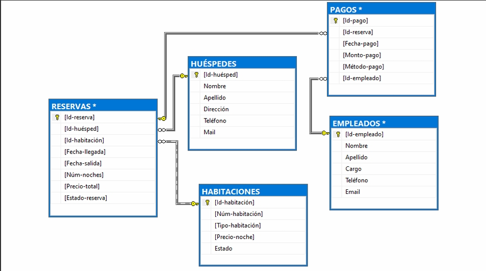

<h1>API REST HOTEL DB</h1>
<p>Proyecto Final CILSA </p>


<h2> Introducción</h2>
Esta documentación te guiará a realizar diferentes consultas hacia la API.

</br>

- [Instalación](#instalación)
  - [Base de datos](#base-de-datos)
  - [.env](#env)
  - [Dependencias:](#dependencias)
- [Ruta inicial](#ruta-inicial)
- [Rutas Empleados](#rutas-empleados)
- [Rutas Habitaciones](#rutas-habitaciones)
- [Rutas Huspedes](#rutas-huspedes)
- [Rutas Pagos](#rutas-pagos)
- [Rutas Reservas](#rutas-reservas)
- [Ejemplos de uso](#ejemplos-de-uso)
  - [GET empleados](#get-empleados)
  - [GET pagos por ID](#get-pagos-por-id)
  - [POST huespedes](#post-huespedes)
  - [PATCH habitaciones por id](#patch-habitaciones-por-id)
  - [DELETE de reservas](#delete-de-reservas)


# Instalación

## Base de datos
En MySQL ejecuta el archivo **database.sql** que se encuentra en la carpeta **db**


## .env
Deberás crear en tu carpeta raíz un archivo de conexion a tu base de datos con nombre **".env"** donde incluirás las siguientes variables con tu informacion local:
```javascript
PORT = 3001
DB_NAME = "hoteldb"
DB_USER = "root"
DB_PASSWORD = "tu contrasena"
DB_HOST = "localhost"
```

## Dependencias:
Asumiendo que tiene node.js preinstalado, asegurese de que su terminal este posicionada en la carpeta raiz del proyecto y ejecute  el siguiente comando para instalar todas las dependencias necesarias:
```
npm install
```

Ahora ya puedes comenzar a ejecutar el programa con el siguiente comando:
```
npm start
```
Comienza a realizar peticiones desde Thunder Client, Postman, u otra alternativa


<br>

# Ruta inicial

|MÉTODO|URL|DESCRIPCION|
|-|-|-|
|GET|http://localhost:3001/|La URL o ruta principal.

# Rutas Empleados
|MÉTODO|URL|DESCRIPCION|
|-|-|-|
|GET| http://localhost:3000/api/empleados | La URL general para visualizar todos empleados.
|GET| http://localhost:3000/api/empleados/:id | La URL para filtrar un empleado por su ID.
|POST| http://localhost:3000/api/empleados | La URL para crear un nuevo empleado.
|PATCH| http://localhost:3000/api/empleados/:id | La URL para modificar la informacion de un empleado por su ID.
|DELETE| http://localhost:3000/api/empleados/:id | La URL para eliminar empleado por su ID.

<br>

# Rutas Habitaciones

|MÉTODO|URL|DESCRIPCION|
|-|-|-|
|GET| http://localhost:3000/api/habitaciones | La URL general para visualizar todas las habitaciones.
|GET| http://localhost:3000/api/habitaciones/:id | La URL para filtrar un habitaciones por su ID.
|POST| http://localhost:3000/api/habitaciones | La URL para crear una nueva habitacion.
|PATCH| http://localhost:3000/api/habitaciones/:id | La URL para modificar la informacion de una habitacion por ID.
|DELETE| http://localhost:3000/api/habitacion/:id | La URL para eliminar una habitacion por su ID.

<br>

# Rutas Huspedes

|MÉTODO|URL|DESCRIPCION|
|-|-|-|
|GET| http://localhost:3000/api/huspedes | La URL general para visualizar todos los huespedes.
|GET| http://localhost:3000/api/huespedes/:id | La URL para filtrar un huesped por su ID.
|POST| http://localhost:3000/api/huesped | La URL para registrar un huesped.
|PATCH| http://localhost:3000/api/huesped/:id | La URL para modificar la informacion de un huesped por ID.
|DELETE| http://localhost:3000/api/huesped/:id | La URL para eliminar un huesped por su ID.

<br>

# Rutas Pagos

|MÉTODO|URL|DESCRIPCION|
|-|-|-|
|GET| http://localhost:3000/api/pagos | La URL general para visualizar todos los pagos.
|GET| http://localhost:3000/api/pagos/:id | La URL para filtrar un pago por su ID.
|POST| http://localhost:3000/api/pagos | La URL para registrar un pago.
|PATCH| http://localhost:3000/api/pagos/:id | La URL para modificar la informacion de un pago por ID.
|DELETE| http://localhost:3000/api/pagos/:id | La URL para eliminar un registro de pago por su ID.

<br>
# Rutas Reservas

|MÉTODO|URL|DESCRIPCION|
|-|-|-|
|GET| http://localhost:3000/api/reservas | La URL general para visualizar todas las reservas.
|GET| http://localhost:3000/api/reservas/:id | La URL para filtrar una reserva por su ID.
|POST| http://localhost:3000/api/reservas | La URL para crear una nueva reserva.
|PATCH| http://localhost:3000/api/reserva/:id | La URL para modificar la informacion de una reserva por ID.
|DELETE| http://localhost:3000/api/reserva/:id | La URL para eliminar una reserva por su ID.


# Ejemplos de uso
## GET empleados
Todas las consultas de tipo GET retornarán un formato JSON.

La URL general para visualizar todos los contenidos.
```py
http://localhost:3001/api/empleados
```

```json
       {
    "Id_empleado": 500,
    "Nombre": "Juan",
    "Apellido": "Romero",
    "Cargo": "Recepcionista",
    "Telefono": "3564586947",
    "Email": "juanrom@live.com"
  },
  {
    "Id_empleado": 501,
    "Nombre": "César",
    "Apellido": "Bustos",
    "Cargo": "Conserje",
    "Telefono": "3564123456",
    "Email": "cesar@outlook.com"
  },
```

## GET pagos por ID
La URL general para visualizar un contenido por su id
```py
http://localhost:3001/api/pagos/22 
```
```json
{
    "Id_pago": 22,
    "Id_reserva": 52,
    "Fecha_pago": "2024-10-23",
    "Monto_pago": 120000,
    "Metodo_pago": "EFECTIVO",
    "Id_empleado": 501
  }
```


## POST huespedes 
La URL que nos retorna el contenido agregado en formato JSON.
```py
http://localhost:3001/api/huespedes
```
```json
{
"nombre": "Karina",
"apellido": "Gonzales",
"cargo": "Chofer",
"telefono": "35862453",
"email": "karina234@hotmail.com"
}
```


## PATCH habitaciones por id
La URL que nos retorna un contenido/s por su categoria.
```py
http://localhost:3000/api/habitaciones/202
```

```json
 {
    "Id_habitacion": 202,
    "Num_habitacion": 22,
    "Tipo_habitacion": "Suite",
    "Precio_noche": 40000,
    "Estado": "Disponible"
  },
```


## DELETE de reservas
La URL que nos permite eliminar un recurso existente
```py
http://localhost:3000/reservas/53
```
Response:
```json
  Status: 204 No Content
```
